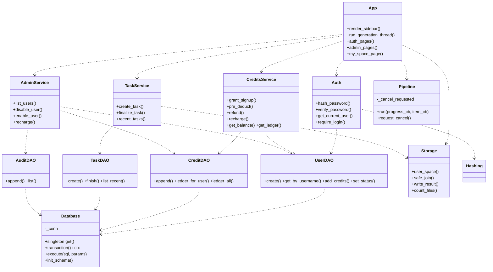
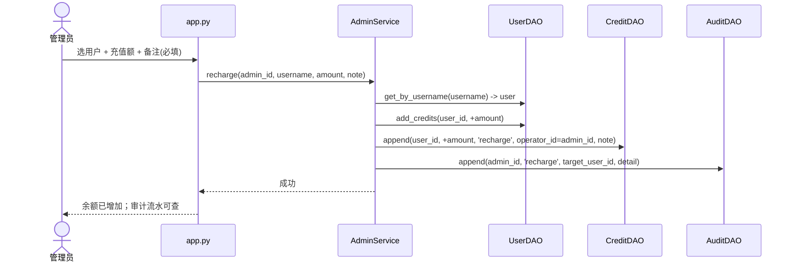

# 跨境内容合规引擎 · 产品化升级架构设计 V2

> 文档类型：架构设计 + 任务分解（供工程师「寇豆码」施工、QA 验收）
> 架构师：高见远（Gao）
> 版本：V2 · 初稿
> 关联文档：`PRD_V2.md`（R01–R21）、`INTEGRATION_FIX_PLAN.md`（F01–F13 诊断）
> 施工硬约束（来自主理人锁定决策）：**不改 `core/` 引擎逻辑；仅 `core/pipeline.py` 允许加 cancel flag 最小侵入；46 项回归测试必须继续通过。**

---

## 0. 总览与必读事实

本升级在 **保留 `core/` 17 个引擎模块不动** 的前提下，于 **Web 层（新增 `dao/`、`auth/`、`credits/`、`tasks/`、`storage/`、`admin/`）** 接入真实用户体系、积分、文件隔离、任务持久化与管理后台。

**已核实的关键事实（毋须再查）：**
- `ARCHITECTURE_FIXES.md` 与 `core/sandbox_v2.py` 在仓库中**不存在**。积分状态机、文件空间隔离全部从零设计，无现成模块可接入。
- `core/output_io.py` 头部明确声明 *"This is NOT a tenant sandbox"* —— **严禁复用 `ensure_output_dir()` / `OUTPUT_DIR` 存用户文件**，必须新建隔离层 `storage/`。
- 现有 `app.py` 假数据位置：`app.py:39`（顶部 `积分 1,240`）、`app.py:293-295`（侧栏 `我的文件 12`/假`最近任务`/`空间已隔离`/`仅你可见`/`积分 1,240`）、`app.py:322`（假 cost-hint `本次预计消耗 180 积分`）。
- 测试用 `AppTest.from_file(app.py)` 且把 `core.llm_client.load_env` 打桩为抛异常（`test_app_boundaries.py`）→ **app.py 在 import 与初始渲染（演示模式）时不能触发任何 DB 连接、不能调用 `load_env`**。DB 初始化必须**懒加载**。

**积分/状态锁定参数（主理人已拍板，直接落地，不再走 PRD 的 Q1–Q6 歧义）：**

| 参数 | 值 | 来源 |
|---|---|---|
| 注册赠送 SIGNUP_BONUS | 100 | Q1 |
| 实时生成每语种 PER_LANGUAGE | 5（按语种数预扣） | Q2 |
| 图像生成每张 PER_IMAGE | 10 | Q3 |
| 取消/失败 | **全额退还**预扣积分 | Q4 |
| 重跑 | 按新语种数重新计费（不二次扣已退部分） | Q4 |
| 管理员账号 | 环境变量 `ADMIN_USERNAME`/`ADMIN_PASSWORD` 种子，首次启动自动建；无变量时本地用默认值（生产必须注入） | Q5 |
| 禁用用户 | = 禁止登录（数据保留） | Q6 |

---

## 1. 实现方案概述 + 技术选型

### 1.1 方案概述
- **存储**：SQLite 单文件，路径 `/mnt/workspace/data/app.db`（ModelScope 持久化目录，容器重启不丢）。本地/测试回退到 `<项目>/data/app.db`。用路径探测 + 环境变量 `APP_DATA_DIR` 切换。
- **访问策略**：免登录 = 演示模式（预生成数据）+ 价值看板；登录后解锁实时生成、积分、我的空间、任务历史。
- **认证**：用户名+密码注册（bcrypt 哈希），`streamlit.session_state` 管理会话；禁用用户禁止登录。
- **隔离**：每用户独立目录 `/mnt/workspace/data/users/{user_id}/...`，路径仅由服务端整数 `user_id` 拼装，**用户名字符串绝不进入路径**。
- **集成方式**：Web 层作为 orchestration 层包住 `Pipeline`；仅向 `Pipeline` 注入 `request_cancel()`（最小侵入）。

### 1.2 新增依赖
在 `requirements.txt` 末尾追加（其余沿用现有 4 项）：

```text
bcrypt>=4.0.1
```

> **ModelScope 部署可达性说明**：bcrypt 4.x 提供 manylinux / musllinux / aarch64 预编译 wheel，`pip install` 在 Linux x86_64 容器**无需编译**。若极端情况无网络/无 wheel，降级方案见 §11 待明确事项（用 `hashlib.pbkdf2_hmac` 兜底，但 PRD 明确要求 bcrypt，优先保证 bcrypt 可用）。

### 1.3 不新增的依赖 / 复用
- `streamlit`（现有）提供 `session_state`、`AppTest`。
- `sqlite3`（Python 标准库）提供存储，无需 SQLAlchemy。

---

## 2. 文件列表及相对路径

```
hackathon_round2/
├── app.py                        # 【改造】顶部假数据清除；新增注册/登录/登出/侧栏分支/生成后台线程/我的空间/最近任务/管理后台；保留 core 调用
├── requirements.txt              # 【改】追加 bcrypt
├── ARCHITECTURE_V2.md            # 本文件
├── dao/
│   ├── __init__.py               # 空
│   ├── db.py                     # 【新】Database 单例：路径解析、WAL、busy_timeout、事务、建表 DDL
│   ├── users_dao.py              # 【新】UserDAO：用户增查、状态/角色、余额读写
│   ├── credits_dao.py            # 【新】CreditDAO：积分流水读写
│   ├── tasks_dao.py              # 【新】TaskDAO：任务增/状态更新/最近任务查询
│   └── audit_dao.py              # 【新】AuditDAO：管理端审计流水
├── auth/
│   ├── __init__.py               # 空
│   ├── hashing.py                # 【新】hash_password / verify_password（bcrypt）
│   └── session.py                # 【新】session_state 读写：当前用户/登录态/角色/登出/拦截
├── credits/
│   ├── __init__.py              # 空
│   ├── pricing.py               # 【新】常量：SIGNUP_BONUS/PER_LANGUAGE/PER_IMAGE
│   └── service.py               # 【新】积分业务：注册赠送/预扣/退还/充值/明细/余额
├── tasks/
│   ├── __init__.py              # 空
│   └── service.py               # 【新】任务业务：建任务/完成/取消/最近任务/结果落盘编排
├── storage/
│   ├── __init__.py              # 空
│   └── space.py                 # 【新】用户隔离目录、safe_join 防穿越、文件计数、结果 JSON 读写
├── admin/
│   ├── __init__.py              # 空
│   └── service.py               # 【新】用户管理（列表/禁用/启用）、充值编排、审计
└── tests/
    ├── test_dao.py              # 【新】DAO 单测（内存 SQLite）
    └── test_credits_service.py  # 【新】积分业务单测（赠送/预扣/退还/充值事务）
```

**app.py 改造分块（在现有结构内插入，不重写整体）：**
1. 顶部壳层（line 36–39）：删除假 `topcredits` 积分 1,240；替换为真实积分胶囊占位（登录后由 session 注入）。
2. 侧栏（line 290–295）：删除假 `我的文件 12/上传 3/产物 9`、假 `最近任务`、假 `空间已隔离`/`仅你可见`、假 `积分 1,240`；改为按登录态分支渲染（§6）。
3. 主区任务表单（line 298–322）：删除 `空间已隔离` 标签、假 cost-hint；cost-hint 改为从 `pricing.py` 实时计算并接真实余额校验。
4. 演示模式（line 345–380）：加预生成免责声明（R07）。
5. 生成执行（line 381–445）：改为后台线程跑 `Pipeline`，加「取消」按钮（R06），生成前预扣积分（R13/R15），结束后落库 + 取消/失败退还。
6. 结果区（line 511–542）：图像生成落用户隔离目录；导出文件名带 product+langN+ts（R08）；友好错误（R09）。
7. 新增页面段：注册/登录表单、我的空间（真实统计）、最近任务（真实列表）、管理员后台（用户管理/充值/审计）。
8. 启动入口：`ensure_seed_admin()` 首次启动自动建种子账号。

---

## 3. SQLite 表结构设计 + DAO 接口

### 3.1 DDL（建表，幂等 `IF NOT EXISTS`）
位置：`dao/db.py` 的 `init_schema()`。开启 `PRAGMA journal_mode=WAL; PRAGMA busy_timeout=5000;`。

```sql
-- 用户表
CREATE TABLE IF NOT EXISTS users (
    user_id      INTEGER PRIMARY KEY AUTOINCREMENT,
    username     TEXT UNIQUE NOT NULL,
    password_hash TEXT NOT NULL,
    role         TEXT NOT NULL DEFAULT 'user',   -- 'user' | 'admin'
    status       TEXT NOT NULL DEFAULT 'active', -- 'active' | 'disabled'
    credits      INTEGER NOT NULL DEFAULT 0,     -- 当前余额（与 ledger 末尾 balance_after 强一致，由事务保证）
    created_at   TEXT NOT NULL,                   -- ISO8601 UTC, e.g. 2026-09-15T08:30:00Z
    updated_at   TEXT NOT NULL
);
CREATE INDEX IF NOT EXISTS idx_users_username ON users(username);
CREATE INDEX IF NOT EXISTS idx_users_status ON users(status);

-- 积分流水（每笔变动一条，含运行余额便于对账）
CREATE TABLE IF NOT EXISTS credit_ledger (
    ledger_id     INTEGER PRIMARY KEY AUTOINCREMENT,
    user_id       INTEGER NOT NULL REFERENCES users(user_id),
    change        INTEGER NOT NULL,     -- 正=增加，负=扣减
    type          TEXT NOT NULL,        -- 'grant'|'consume'|'refund'|'recharge'|'adjust'
    task_id       INTEGER,              -- consume/refund 关联 tasks.task_id
    balance_after INTEGER NOT NULL,     -- 变动后余额（运行余额）
    operator_id   INTEGER,              -- 操作者（充值=管理员 user_id；其他可 NULL）
    note          TEXT,                 -- 备注（充值必填）
    created_at    TEXT NOT NULL
);
CREATE INDEX IF NOT EXISTS idx_ledger_user ON credit_ledger(user_id);
CREATE INDEX IF NOT EXISTS idx_ledger_task ON credit_ledger(task_id);
CREATE INDEX IF NOT EXISTS idx_ledger_created ON credit_ledger(created_at);

-- 任务表（持久化，跨会话保留）
CREATE TABLE IF NOT EXISTS tasks (
    task_id         INTEGER PRIMARY KEY AUTOINCREMENT,
    user_id         INTEGER NOT NULL REFERENCES users(user_id),
    product_name    TEXT,
    product_name_en TEXT,
    languages       TEXT NOT NULL,      -- JSON: ["en","ar"]
    platforms       TEXT NOT NULL,      -- JSON: ["tiktok","instagram"]
    language_count  INTEGER NOT NULL,
    platform_count  INTEGER NOT NULL,
    compliance_level TEXT,
    status          TEXT NOT NULL,      -- 'pending'|'running'|'completed'|'cancelled'|'failed'
    credit_cost     INTEGER NOT NULL DEFAULT 0,  -- 预扣/实际消耗
    credit_refunded INTEGER NOT NULL DEFAULT 0,  -- 退还额
    result_summary  TEXT,               -- JSON: {delivered,review_blocked,failed,skipped}
    result_path     TEXT,               -- 结果 JSON 落盘路径（用户隔离目录内）
    created_at      TEXT NOT NULL,
    finished_at     TEXT                -- 完成/取消/失败时间
);
CREATE INDEX IF NOT EXISTS idx_tasks_user ON tasks(user_id);
CREATE INDEX IF NOT EXISTS idx_tasks_created ON tasks(user_id, created_at DESC);

-- 管理端审计流水（所有管理操作落库）
CREATE TABLE IF NOT EXISTS audit_log (
    audit_id       INTEGER PRIMARY KEY AUTOINCREMENT,
    operator_id    INTEGER NOT NULL,    -- 管理员 user_id
    action         TEXT NOT NULL,       -- 'disable_user'|'enable_user'|'recharge'|'login_blocked'
    target_user_id INTEGER,             -- 受影响用户
    detail         TEXT,                -- JSON 备注
    created_at     TEXT NOT NULL
);
CREATE INDEX IF NOT EXISTS idx_audit_operator ON audit_log(operator_id);
CREATE INDEX IF NOT EXISTS idx_audit_target ON audit_log(target_user_id);
```

### 3.2 DAO 接口定义（类方法签名，实现走 SQLite，将来可换 PG）
> 约定：所有 DAO 方法为 `@classmethod`，底层统一经 `Database` 单例。返回 dict / list[dict] / 标量。不抛业务异常时一律成功返回；失败抛 `ValueError`/`sqlite3.Error` 由上层捕获。

```python
# dao/users_dao.py
class UserDAO:
    @classmethod
    def create(cls, username: str, password_hash: str, role: str = "user",
               credits: int = 0) -> int: ...          # 返回新 user_id
    @classmethod
    def get_by_username(cls, username: str) -> dict | None: ...
    @classmethod
    def get_by_id(cls, user_id: int) -> dict | None: ...
    @classmethod
    def exists_username(cls, username: str) -> bool: ...
    @classmethod
    def set_status(cls, user_id: int, status: str) -> None: ...     # 'active'/'disabled'
    @classmethod
    def set_role(cls, user_id: int, role: str) -> None: ...
    @classmethod
    def get_credits(cls, user_id: int) -> int: ...
    @classmethod
    def add_credits(cls, user_id: int, delta: int) -> int: ...     # 事务内更新余额，返回新余额
    @classmethod
    def list_all(cls, *, only_active: bool = False) -> list[dict]: ...

# dao/credits_dao.py
class CreditDAO:
    @classmethod
    def append(cls, user_id: int, change: int, type: str, *,
               task_id: int | None = None, balance_after: int,
               operator_id: int | None = None, note: str | None = None) -> int: ...  # 仅插入流水
    @classmethod
    def ledger_for_user(cls, user_id: int, *, type: str | None = None,
                        since: str | None = None, until: str | None = None,
                        limit: int = 200) -> list[dict]: ...
    @classmethod
    def ledger_all(cls, *, user_id: int | None = None, action: str | None = None,
                   since: str | None = None, until: str | None = None,
                   limit: int = 500) -> list[dict]: ...

# dao/tasks_dao.py
class TaskDAO:
    @classmethod
    def create(cls, user_id: int, product_name: str, product_name_en: str,
               languages: list, platforms: list, compliance_level: str) -> int: ...
    @classmethod
    def set_running(cls, task_id: int) -> None: ...
    @classmethod
    def finish(cls, task_id: int, status: str, *, credit_cost: int,
               credit_refunded: int, result_summary: dict, result_path: str | None) -> None: ...
    @classmethod
    def get(cls, task_id: int) -> dict | None: ...
    @classmethod
    def list_recent(cls, user_id: int, limit: int = 20) -> list[dict]: ...

# dao/audit_dao.py
class AuditDAO:
    @classmethod
    def append(cls, operator_id: int, action: str, target_user_id: int | None,
               detail: dict | None = None) -> int: ...
    @classmethod
    def list(cls, *, operator_id: int | None = None, target_user_id: int | None = None,
             action: str | None = None, limit: int = 500) -> list[dict]: ...
```

---

## 4. 核心类图（Mermaid）



---

## 5. 关键时序图（Mermaid）

### 5.1 注册 / 登录
```mermaid
sequenceDiagram
    actor U as 用户
    participant A as app.py
    participant Auth as Auth
    participant UD as UserDAO
    participant CD as CreditDAO
    participant DB as Database

    U->>A: 提交注册(用户名,密码)
    A->>UD: exists_username()
    UD-->>A: False
    A->>Auth: hash_password(密码)
    Auth-->>A: bcrypt哈希
    A->>DB: transaction {
        UD.create(用户名,哈希) -> user_id
        UD.add_credits(user_id, +100)
        CD.append(user_id, +100, 'grant', balance_after=100)
    }
    A->>Auth: set_current_user(user_id, 角色, 余额)
    A-->>U: 自动登录，跳转工作台（余额 100 真实显示）
```

### 5.2 生成任务（预扣 → 执行 → 取消/失败退还 → 落库）
```mermaid
sequenceDiagram
    actor U as 用户
    participant A as app.py(主线程)
    participant CS as CreditsService
    participant TS as TaskService
    participant P as Pipeline(后台线程)
    participant DB as Database

    U->>A: 选 N 语种 + 平台，点「开始生成」
    A->>CS: pre_deduct(user_id, N*5)
    alt 余额不足
        CS-->>A: raise InsufficientCredits
        A-->>U: 友好提示「积分不足，请联系管理员充值」（不进入生成）
    else 余额充足
        CS->>DB: txn { add_credits(-N*5); CD.append(consume, balance_after) }
        CS-->>A: 预扣成功，余额刷新
        A->>TS: create_task(...) -> task_id, status=pending
        A->>P: 启动后台线程 run(progress_cb, item_cb)
        A->>A: 轮询队列渲染进度 + 显示「取消」按钮

        Note over U,A: 用户中途点「取消」
        U->>A: 点「取消」
        A->>P: request_cancel()  -> client.cancel()(threading.Event)
        P->>P: 未提交组合标记 skipped(原因=用户取消)；在途调用抛 CallStopped 短路
        P-->>A: result.meta.cancelled = True

        A->>TS: finalize_task(task_id, 'cancelled', credit_refunded=N*5)
        A->>CS: refund(user_id, task_id, N*5)
        CS->>DB: txn { add_credits(+N*5); CD.append(refund, balance_after) }
        A-->>U: 回到可重新提交态，余额复原
    end
```
> 成功/失败分支同构：成功 `status=completed` 不退还；失败 `status=failed` 全额退还（`credit_refunded=N*5`）。

### 5.3 管理员充值


---

## 6. Streamlit 会话与页面流设计

### 6.1 session_state 键定义（统一前缀 `auth_` / `_gen_`）
| 键 | 类型 | 含义 |
|---|---|---|
| `auth_user_id` | int | 当前登录用户 DB id；None=访客 |
| `auth_username` | str | 登录用户名 |
| `auth_role` | str | `'user'` / `'admin'` |
| `auth_credits` | int | 当前余额缓存（登录时写入，变动后刷新） |
| `_gen_thread` | threading.Thread | 进行中的生成线程 |
| `_gen_pipeline` | Pipeline | 进行中的 pipeline 实例（供取消） |
| `_gen_task_id` | int | 关联 tasks.task_id |
| `_gen_queue` | queue.Queue | 进度/条目消息队列（线程→主线程） |
| `_gen_result` | dict | 生成结果快照 |
| `_gen_error` | Exception | 生成异常 |
| `result` / `_result_source` | dict/str | 现有演示结果（保留） |

### 6.2 登录态在 rerun 间保持
Streamlit 的 `session_state` 跨 rerun 持久（同一浏览器会话）。登录即写 `auth_user_id` 等键；登出 `del` 这些键或置 None。所有页面读 `auth_user_id` 是否为 None 判断访客/登录。

### 6.3 侧栏按登录态渲染的分支（替换 app.py:290–295）
```
with st.sidebar:
    渲染品牌
    if auth_user_id is None:
        # 访客：仅演示入口 + 「登录/注册」按钮
        渲染「登录 / 注册」按钮（点击展开表单或切换页面）
        提示「登录后解锁实时生成 / 积分 / 我的空间」
    else:
        渲染「+ 新建生成任务」「我的空间（真实统计）」「最近任务（真实列表）」
        渲染积分胶囊：显示 auth_credits 真实余额（替换假 1,240）
        if auth_role == 'admin':
            渲染「管理后台」入口
        渲染「登出」
```
- 未登录触发需登录功能（如点「开始生成」「我的空间」）→ **引导登录**（`st.switch_page`/展示登录表单），**绝不静默失败或报 traceback**（对应 R21 / US-G1.AC3）。
- 假文案（`空间已隔离`/`仅你可见`/`我的文件 12`/假`最近任务`/`积分 1,240`/`注册赠送 666 · 按 token 倍率扣费`）**全部删除**，未实装期显示「开发中」或干脆隐藏。

---

## 7. 文件空间隔离方案

### 7.1 目录结构（仅整数 user_id 拼装，杜绝用户名注入）
```
/mnt/workspace/data/            # 或本地 <项目>/data/
├── app.db
└── users/
    ├── 1/                      # user_id=1
    │   ├── inputs/             # 上传的资料
    │   ├── outputs/            # 生成产物（文案 JSON / 图片）
    │   └── tasks/<task_id>/result.json   # 单任务结果落盘
    └── 2/
        └── ...
```

### 7.2 路径拼装 API（`storage/space.py`）
```python
def user_space(user_id: int) -> Path: ...
def inputs_dir(user_id: int) -> Path: ...      # .../users/{user_id}/inputs
def outputs_dir(user_id: int) -> Path: ...     # .../users/{user_id}/outputs
def task_dir(user_id: int, task_id: int) -> Path: ...  # .../users/{user_id}/tasks/{task_id}
def write_result(user_id, task_id, result: dict) -> Path: ...  # 原子写 result.json
def count_files(dir: Path) -> int: ...         # 真实统计（替换假 12/3/9）
def safe_join(base: Path, *parts: str) -> Path: ...   # 防目录穿越
```

### 7.3 防目录穿越安全约束（医疗场景，底线）
1. **路径只由服务端整数 ID 拼装**：`user_id`/`task_id` 一律为 DB 自增整数，绝不接受用户字符串拼接进路径。用户名（可能含 `..`、`/`）**永远不进入文件路径**。
2. **`safe_join` 规范化校验**：对上传文件名等外部输入，先 `secure_filename`（仅保留 `[A-Za-z0-9._-]`、截断长度），再 `Path(base).resolve()` 与 `base.resolve()` 比对，若不在 base 内则拒绝（防 `../`、绝对路径、`\\` 等）。
3. **上传文件落盘**：`<inputs_dir>/<uuid4().hex>_<secure_filename(原名)>`，原始文件名仅作展示，不用于路径。
4. **跨用户访问拒绝**：所有「我的空间 / 我的产物」读取均以 `auth_user_id` 为根，接口层 assert `requested_user_id == auth_user_id`（管理员后台读取他人数据走独立审计接口，不暴露文件目录）。
5. **结果落盘用 `atomic_write` 思路**（参考 `core/output_io.atomic_write`）：先写临时文件再 `os.replace`，避免半写文件。

---

## 8. Pipeline cancel flag 设计（最小侵入）

### 8.1 改动范围（仅 `core/pipeline.py`，不动 `core/` 其它）
1. `__init__` 末尾加：`self._cancel_requested = False`
2. 新增方法：
```python
def request_cancel(self) -> None:
    """用户取消：置标志 + 复用 LLMClient.cancel() 让在途调用尽快抛 CallStopped。"""
    self._cancel_requested = True
    if isinstance(self.client, LLMClient):
        try:
            self.client.cancel()   # threading.Event.set() -> _check_call 抛 CallStopped
        except Exception:
            pass
```
3. `run()` 内两处循环复用现有 deadline 跳过逻辑，追加 cancel 判断：
   - 阶段 2（平台适配）提交前：`if time.monotonic() >= deadline or self._cancel_requested:` → 跳过该平台（但平台适配失败=整平台组合 failed，cancel 时标记 skipped）。
   - 阶段 3（组合）`for p, l in combos:`：`if time.monotonic() >= deadline or self._cancel_requested: result["results"].append(self._skipped_item(p, l, "用户取消")); icb(...); continue`
   - `as_completed` 循环内，原 `if time.monotonic() >= deadline:` 改为 `if time.monotonic() >= deadline or self._cancel_requested:`，并对剩余 `futs` 调 `other.cancel()`。
   - `run()` 末尾：`if self._cancel_requested: result["meta"]["cancelled"] = True`（供 app 判定任务状态）。
4. 在途组合因 `client.cancel()` 触发 `CallStopped`，被 `_run_combo` 的 `except CallStopped` 捕获 → 标记 `skipped_deadline`（已在现有代码），与 deadline 行为一致。

### 8.2 app 侧后台线程 + 取消按钮（施工要点）
`Pipeline.run()` 同步阻塞主线程，Streamlit 按钮在阻塞期间无法点击。故：
- 用 `threading.Thread(daemon=True)` 跑 `pipeline.run()`，进度回调 `cb/icb` 仅 `queue.Queue.put(...)`（**禁止在子线程直接写 Streamlit 元素**）。
- 主线程轮询队列，渲染进度；显示「取消」按钮。
- 取消按钮 handler：`st.session_state["_gen_pipeline"].request_cancel()` 然后 `st.rerun()`。
- 线程结束后：读 `_gen_result`，若 `meta.cancelled` → 任务记 `cancelled` 并 `refund`；若异常 → `failed` 并 `refund`；正常 → `completed` 不退还；统一 `TaskDAO.finish` + `write_result` 落盘。

---

## 9. 有序任务列表（给工程师「寇豆码」的施工图）

> 粒度：一个模块一批文件。依赖箭头标清先后顺序。验收方式可写成单元/集成测试或 UI 人工核对。

### Batch A — 基础设施与持久化层（DAO）
- **A1 `dao/db.py`**：`Database` 单例（懒加载、路径解析、WAL、busy_timeout、写重试、事务上下文）、`init_schema()`（§3.1 DDL）。
  - 依赖：无。验收：`python -c "from dao.db import Database; Database.get().init_schema()"` 在临时目录建出 4 表；`PRAGMA journal_mode`=wal。
- **A2 `dao/users_dao.py` `dao/credits_dao.py` `dao/tasks_dao.py` `dao/audit_dao.py`**：按 §3.2 实现。
  - 依赖：A1。验收：同进程连库 CRUD 通；`add_credits` 在事务内更新余额。

### Batch B — 认证与会话
- **B1 `auth/hashing.py`**：`hash_password`/`verify_password`（bcrypt，带随机 salt）。
  - 依赖：无。验收：自测 `verify_password(pw, hash_password(pw))`=True，错误密码=False。
- **B2 `auth/session.py`**：`get_current_user()`/`set_current_user()`/`logout()`/`require_login()`/`is_admin()`，封装 §6.1 键。
  - 依赖：无。验收：session 读写单测。
- **B3 `app.py` 注册/登录/登出 + 种子管理员**：`ensure_seed_admin()` 启动自动建 `ADMIN_USERNAME`/`ADMIN_PASSWORD`（无变量用默认值 `admin`/`admin` 仅本地）。注册即 `UserDAO.create` + `CreditsService.grant_signup` + 自动登录（`set_current_user`）。
  - 依赖：A2,B1,B2。验收：注册重复用户名报错；登录错误统一提示「用户名或密码错误」；禁用用户登录被拦（落 `login_blocked` 审计）。
- **B4 `app.py` 侧栏分支 + 登录拦截**：按 §6.3 改造 `app.py:290–295`，删全部假文案。
  - 依赖：B3。验收：访客看不到实时生成入口；触发时引导登录（R21）。

### Batch C — 积分与业务服务
- **C1 `credits/pricing.py`**：常量 `SIGNUP_BONUS=100` / `PER_LANGUAGE=5` / `PER_IMAGE=10`。
- **C2 `credits/service.py`**：`grant_signup` / `pre_deduct`（余额不足抛 `InsufficientCredits`）/ `refund` / `recharge`（管理员）/`get_balance`/`get_ledger`。所有余额变动在 `Database.transaction()` 内 + `credits_lock`（`threading.Lock`）串行化防双花。每次变动同时 `UserDAO.add_credits` 与 `CreditDAO.append(balance_after)`。
  - 依赖：A2。验收：`test_credits_service.py`（注册+100；预扣扣 N*5 且余额一致；取消/失败退还复原；充值+amount 且 audit 有记录；并发预扣不超扣）。
- **C3 余额接入 app**：注册赠送接入 C2；`app.py:322` 假 cost-hint 改为 `N*PER_LANGUAGE` 实时估算；侧栏积分胶囊显示 `auth_credits`（R02）。
  - 依赖：B3,C2。验收：登录后胶囊为真实余额；余额不足提交即拦截（R15）。

### Batch D — 任务持久化
- **D1 `tasks/service.py`**：`create_task`（status=pending，算 language/platform count）/ `finalize_task`（写 status、counts、result_path）/ `recent_tasks`。结果 JSON 经 `storage.write_result` 落用户目录。
  - 依赖：A2,§7。验收：建任务→完成→`list_recent` 返回且跨调用持久。
- **D2 `app.py` 最近任务真实列表**：渲染 `TaskDAO.list_recent`，每条含产品名/语种数/平台数/完成时间/概览（R18）。
  - 依赖：D1。验收：退出重登列表一致（S5）。

### Batch E — 文件空间隔离
- **E1 `storage/space.py`**：§7.2 API + `safe_join` 防穿越 + `count_files`（真实统计）。
  - 依赖：无。验收：`safe_join` 单测拒绝 `../`/绝对路径；`count_files` 计数正确。
- **E2 `app.py` 我的空间真实统计**：替换假 `12/3/9` 为 `count_files(inputs_dir)`/`count_files(outputs_dir)`（R03/R17）。
  - 依赖：E1,B3。验收：上传文件落 `inputs_dir`；产物落 `outputs_dir`；数字来自真实目录。
- **E3 上传 + 导出文件名**：上传走 `safe_join`；导出文件名 `{product}_{langN}lang_{ts}.json/.md`（R08）；图像生成落 `outputs_dir`（替换 `ensure_output_dir()`，仅访客演示模式保留后者）。
  - 依赖：E1。验收：多次导出文件名可区分；A 用户不可经任何接口读 B 目录。

### Batch F — Pipeline 取消
- **F1 `core/pipeline.py` 最小侵入**：§8.1 的 `_cancel_requested` + `request_cancel()` + `run()` 两处循环判断。
  - 依赖：无。验收：现有 46 回归测试全过；新增单测「设置 request_cancel 后 run 提前结束且 meta.cancelled=True、无残留线程」。
- **F2 `app.py` 后台线程生成 + 取消 + 退还 + 落库**：§8.2 模式；「取消」按钮；结束按状态 `finalize_task` + `refund`（cancel/failed）。
  - 依赖：F1,C2,D1。验收：生成中点取消→停止无崩溃→余额复原→任务状态 cancelled（R06/S2）。

### Batch G — 管理后台
- **G1 `admin/service.py`**：`list_users` / `disable_user`（落 audit）/ `enable_user`（落 audit）；充值委托 `CreditsService.recharge`（已落 ledger+audit）。
  - 依赖：A2,C2。验收：禁用后该用户登录被拦；充值流水可查。
- **G2 `app.py` 管理员页面**：用户列表（用户名/注册时间/状态/积分）、禁用按钮、充值表单（用户名+额+备注必填）、审计页（任务流水 `tasks` + 积分流水 `credit_ledger`，按用户/时间筛选）。仅 `auth_role=='admin'` 可见。
  - 依赖：G1。验收：3 类操作各至少 1 条成功记录（S4）。

### Batch H — P0 清理误导 + P1 体验
- **H1 `app.py` 删假文案（R01–R05）**：`app.py:39` 假积分、`app.py:293-295` 假文件数/假最近任务/`空间已隔离`/`仅你可见`、`:322` 假 cost-hint，全部按 §6.3 重写。
  - 依赖：B4,C3,E2,D2。验收：页面全文 grep 无「空间已隔离」「积分 1,240」「我的文件 12」「仅你可见」（S1）；V01 通过。
- **H2 P1 体验（R06/R07/R08/R09）**：R06 在 F2；R07 预生成免责声明（含 `generated_at`）；R08 在 E3；R09 全局 `try/except` 包裹 Pipeline/IO/网络，中文友好提示，禁显 traceback。
  - 依赖：F2。验收：断网/损坏文件→友好提示无 traceback（V13）。

### Batch I — 部署与回归
- **I1 `requirements.txt` + 部署脚本**：追加 `bcrypt>=4.0.1`；确认 Dockerfile 不在构建期访问 `/mnt/workspace`（用 `os.path.exists` 探测回退）；注入 `ADMIN_USERNAME`/`ADMIN_PASSWORD` 环境变量。
  - 依赖：全部。验收：`pip install -r requirements.txt` 含 bcrypt。
- **I2 回归 + 上线验证**：`python -m unittest discover` 46 原测试 + 新增 `test_dao.py`/`test_credits_service.py` 全过（V08）；ModelScope 部署 `ms deploy`，curl 返回 200（V09），逐页核对 S1–S5。
  - 依赖：I1。验收：V01–V10 全过。

---

## 10. 共享知识（跨文件约定）

- **`user_id` 类型**：一律为 `int`（DB 自增主键）。**绝不**用 `username` 拼路径或做索引键。
- **时间戳格式**：统一 ISO8601 UTC 字符串 `'%Y-%m-%dT%H:%M:%SZ'`（见 `core/pipeline.py` 已用 `isoformat(timespec='seconds')`，建议补 `'Z'` 后缀）。跨会话/跨时区一致。
- **积分流水事务边界**：任何「余额变动」必须是 **单事务**：`BEGIN` → `UserDAO.add_credits(delta)` → `CreditDAO.append(change, type, balance_after=新余额)` → `COMMIT`。失败 `ROLLBACK`。用模块级 `credits_lock = threading.Lock()` 串行化所有余额写，杜绝并发双花。
- **DAO 单例模式**：`Database` 全局单例（`Database.get()`），所有 DAO 经它取连接；不在业务代码里 `sqlite3.connect`。连接懒创建（首次 `get()` 触发 `init_schema`），**import 阶段不连库**，保证 AppTest 不触 DB。
- **WAL 与并发**：`PRAGMA journal_mode=WAL; PRAGMA busy_timeout=5000;`；写操作遇 `database is locked` 做指数退避重试（最多 5 次）。读多写少，WAL 下读写可并发。
- **密码哈希**：bcrypt，`gensalt()` 随机盐，存储完整 `$2b$...` 哈希串；验证用 `checkpw`，**恒定时间比较**，禁止自写比较。
- **错误友好化**：业务层捕获异常后向用户展示中文文案（如「生成失败：模型服务暂时不可用，请稍后重试」），原始异常仅 `logging` 到服务端，页面绝不 `str(e)` 直出（R09）。
- **演示模式数据**：`samples/precomputed_full.json` 为共享预生成数据，免登录可加载；其 `generated_at` 用于免责声明（R07）。不写入用户目录。

---

## 11. 待明确事项（设计层面风险点，请主理人拍板/知悉）

1. **bcrypt 在 ModelScope 环境的轮子可用性（中风险）**：若部署环境无 bcrypt wheel 且无编译链，`pip install` 会失败阻断部署。建议：部署前在目标镜像实测 `pip install bcrypt`；若不可行，降级为 `hashlib.pbkdf2_hmac('sha256', pw, salt, 200_000)`（零依赖，密码学上足够），但需同步更新 PRD R10「bcrypt」措辞。请主理人确认是否接受兜底方案。
2. **后台线程生成 + Streamlit UI 实时更新（实现难点，中风险）**：`Pipeline.run()` 阻塞，UI 进度需在子线程经 `queue.Queue` 投递、主线程渲染（§8.2）。需注意 Streamlit 脚本重入：
   - 线程对象存 `session_state`，rerun 后主线程轮询队列并 `st.rerun()` 维持轮询；线程结束才落库。
   - 取消后主线程需等 worker 真正结束再 finalize，避免竞态。此为施工重点，建议在 Batch F 单独立一个集成测试模拟取消。
3. **长事务与 SQLite 写并发（低风险，已缓解）**：WAL + busy_timeout + `credits_lock` 已覆盖；但管理员批量操作/审计查询与用户生成并发时，单写连接仍是瓶颈。内测期（单容器、低并发）可接受；若上量需评估 PostgreSQL（DAO 抽象已预留切换点）。
4. **图像生成计费边界（已按 Q3=10/张，但需确认）**：PRD F11 原「费用显式 unknown」。现锁定「每张 10 积分」，但 UI 默认不生图（`app.py:519` 显式按钮）。若一次生成多张，预扣 = 张数×10；建议 UI 在生图前单独确认并预扣，取消同样退还。请主理人确认「多张」是否一次性或逐张计费。
5. **种子管理员默认值（安全风险，已按 Q5）**：无环境变量时本地用 `admin/admin` 仅限本地；**生产必须 `ADMIN_PASSWORD` 注入且强口令**，否则任何人可登管理员。建议在启动日志明确告警「使用默认管理员凭据」。
6. **任务结果落盘体积（低风险）**：`result.json` 含完整四步合规细节，可能较大；用户目录按 task_id 分文件，长期需清理策略（如保留最近 N 个）。内测期可暂不清理，建议记一笔 TODO。

---

> 文档结束。施工按 Batch A→I 顺序，工程师拿到 §9 即可逐批编码，无需再做设计决策；所有锁定参数已在 §0 与 §10 固化。
