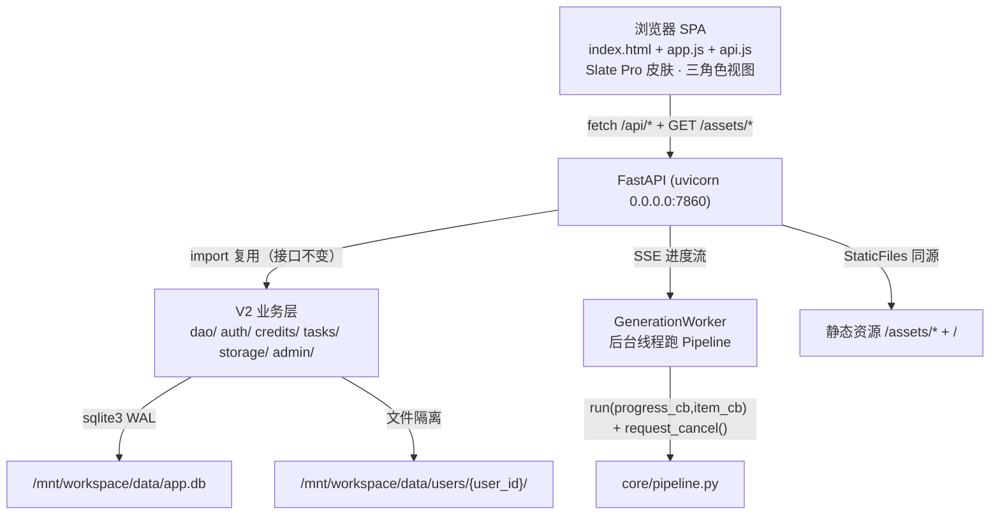

# 跨境内容合规引擎 · 产品化升级架构设计 V3（Docker + FastAPI + Slate Pro 像素级还原）

> 文档类型：架构设计 + 任务分解（供工程师「寇豆码」施工、QA 验收）
> 架构师：高见远（Gao）
> 版本：V3 · 初稿
> 关联文档：`ARCHITECTURE_V2.md`（业务层，全量复用）、`PRD_V2.md`、`SKIN-SPEC.md`、`ui-redesign/index.html`（设计原型）
> 施工硬约束（来自主理人锁定决策）：**V2 业务层（dao/ auth/ credits/ tasks/ storage/ admin/ core/ 引擎）对外接口不变、97 项测试必须继续通过；UI 壳子换成 FastAPI + 静态 SPA，部署形态换成 Docker；服务监听 0.0.0.0:7860。**

---

## 0. 总览与必读事实

V2 已把 Streamlit `app.py` 做成完整产品化应用（用户体系 / 积分 / 隔离 / 持久化 / 管理后台 / cancel flag），并沉淀了 **97 项测试**。V3 **不重写业务层**，而是把前端 UI 从 Streamlit 换成**像素级还原设计稿的真实前端（Slate Pro 皮肤）**，后端从 Streamlit 运行时换成 **FastAPI**，部署从「ModelScope 创空间」换成 **Docker 容器**。

**已核实的事实（毋须再查）：**
- V2 业务层已实现并带测试：`dao/`(db+4 DAO)、`auth/hashing.py`、`credits/`(pricing+service)、`tasks/service.py`、`storage/space.py`、`admin/service.py`、`core/pipeline.py`(含 `request_cancel()`)。
- 设计原型 `ui-redesign/index.html`：单文件 HTML，内联 CSS（Slate/Amber/Paper 三套 token 皮肤，仅 Slate 本期落地），`data-skin` 切换；三套角色视图（`#app-guest` / `#app-user` / `#app-admin`）；图标用 `assets/icons.js` 的 `mxicon(name,size)` 注入 `<i class="ico" data-icon="...">`；底部 `.rolebar` 是原型专用切换条，真实产品删除。
- V2 积分参数已锁定：注册 100 / 每语种 5 / 每图 10 / 取消失败全额退 / 充值走管理员 / 禁用=禁登录。
- 复用清单来自主理人确认；`test_app_boundaries.py`（基于 `AppTest.from_file(app.py)`）是 V2 的 Streamlit 专属测试，V3 改成 FastAPI 后该文件**需重构**（允许重写测试本身），其余 97 项中非 Streamlit 部分保持不变。

**平台硬约束（已验证，来自主理人）：**
1. Docker 创空间：服务监听 **0.0.0.0:7860**（8080 被占用）；用户已实名，Docker 可用。
2. 平台保留 `Authorization`、`X-modelscope-*`、`X-studio-*` 头 → 会话认证**必须 Cookie**（`cce_session`），不可用 Bearer/自定义头。
3. `/mnt/workspace` 运行时持久化（DB + 用户目录继续放这里）；构建期不可用（Dockerfile 不能用，运行时 `os.path.exists` 探测回退）。
4. secrets 已注入：`ADMIN_USERNAME` / `ADMIN_PASSWORD`（环境变量读取）。
5. 免登录可看演示模式（`samples/precomputed_full.json`）+ 价值看板；登录解锁实时生成 / 积分 / 我的空间 / 任务历史。

---

## 1. 总体架构

### 1.1 形态
```
浏览器 SPA（静态文件，Slate Pro 皮肤，直连）
      │  HTTPS / 同源（同 7860 端口）
      ▼
FastAPI 应用（main.py：REST + SSE + 静态资源服务）
      │  import + 复用（接口不变）
      ▼
V2 业务层（dao/ auth/ credits/ tasks/ storage/ admin/）+ core/ 引擎（pipeline）
      │  sqlite3
      ▼
SQLite 单文件 /mnt/workspace/data/app.db + 用户目录 /mnt/workspace/data/users/{user_id}/
```
- **无独立前端构建**：SPA 是纯静态 HTML/CSS/JS（`index.html` + `app.js` + `api.js` + `assets/`），由 FastAPI 的 `StaticFiles` 服务，与 API 同源同端口 → 天然规避 CORS 与保留头冲突。
- **无 Node/npm 链**：保留「纯静态 + Python」的技术基调（与 V2 一致），部署简单。

### 1.2 总体架构图（Mermaid）


---

## 2. 后端：FastAPI 设计

### 2.1 应用结构（main.py 路由分块）
新增 `api/` 包，不改动 `app.py`（Streamlit 版保留）：
```
api/
├── __init__.py
├── main.py          # FastAPI 实例、CORS（同源无需）、静态服务挂载、启动 seed_admin、异常处理器
├── deps.py          # get_current_user / get_current_admin（从 Cookie 解析会话）、credits 不足异常
├── schemas.py       # Pydantic 请求/响应模型
├── session.py       # Cookie 会话：签发/校验 cce_session（itsdangerous 签名）
├── routers/
│   ├── auth.py      # 注册/登录/登出/当前用户/演示预览
│   ├── generate.py  # 创建生成任务 + SSE 进度 + 取消
│   ├── tasks.py     # 最近任务列表/详情/结果下载
│   ├── credits.py   # 余额/明细
│   ├── space.py     # 我的空间统计/上传/产物列举
│   └── admin.py     # 用户管理/禁用/充值/审计（仅 admin）
└── generation.py    # GenerationWorker：后台线程跑 Pipeline + 进度入 SSE 队列 + 取消/退还/落库
```
> 复用层零改动：`dao/`、`auth/hashing.py`、`credits/`、`tasks/`、`storage/`、`admin/`、`core/` 直接 import。

### 2.2 完整端点表（方法 / 路径 / 请求 / 响应 / 鉴权）
> 鉴权列：`公开`=免登录；`登录`=需 `cce_session`；`管理员`=需 admin 角色。`GET /` 与 `/assets/*` 为静态。

| # | 方法 | 路径 | 请求体 / 参数 | 响应 | 鉴权 |
|---|---|---|---|---|---|
| 1 | GET | `/` | — | `index.html`（SPA 入口） | 公开 |
| 2 | GET | `/assets/*` | 路径 | 静态资源（css/js/png/icons.js） | 公开 |
| 3 | POST | `/api/auth/register` | `{username,password}` | `{user_id,username,role,credits}` + `Set-Cookie` | 公开 |
| 4 | POST | `/api/auth/login` | `{username,password}` | `{user_id,username,role,credits}` + `Set-Cookie` | 公开 |
| 5 | POST | `/api/auth/logout` | — | `{}` + 清 Cookie | 登录 |
| 6 | GET | `/api/auth/me` | — | `{user_id,username,role,credits,status}` 或 401 | 登录 |
| 7 | GET | `/api/demo/precomputed` | — | 预生成全量产物（演示模式，含 `generated_at`） | 公开 |
| 8 | GET | `/api/value-board/params` | — | 看板默认参数（可前端调，纯计算） | 公开 |
| 9 | POST | `/api/generate` | `{product_name,product_name_en,form,deployment,marketing_notes,languages,platforms,compliance_level,deadline_s,models}` | `{task_id}`（已预扣积分、已建 pending 任务）或 402 余额不足 | 登录 |
| 10 | GET | `/api/generate/{task_id}/stream` | — | **SSE**：`progress`/`item`/`done`/`cancelled`/`failed` 事件 | 登录（同用户） |
| 11 | POST | `/api/generate/{task_id}/cancel` | — | `{}`（触发 `request_cancel`） | 登录（同用户） |
| 12 | GET | `/api/tasks/recent` | `?limit=20` | `{tasks:[{task_id,product_name,language_count,platform_count,status,summary,created_at}]}` | 登录 |
| 13 | GET | `/api/tasks/{task_id}` | — | 任务详情 + 结果摘要 | 登录（同用户） |
| 14 | GET | `/api/tasks/{task_id}/result` | — | 结果 JSON 下载（或内联） | 登录（同用户） |
| 15 | GET | `/api/credits/balance` | — | `{credits}` | 登录 |
| 16 | GET | `/api/credits/ledger` | `?type=&since=&until=&limit=` | `{ledger:[{change,type,balance_after,note,created_at}]}` | 登录 |
| 17 | GET | `/api/space/stats` | — | `{inputs,uploads,outputs}`（真实目录计数） | 登录 |
| 18 | POST | `/api/space/upload` | `multipart file` | `{file_id,name,size}`（落 `inputs/`，safe_join） | 登录 |
| 19 | GET | `/api/space/files` | `?kind=inputs|outputs` | `{files:[{name,size,created_at}]}` | 登录 |
| 20 | GET | `/api/space/file/{file_id}` | — | 文件字节（下载） | 登录（同用户） |
| 21 | GET | `/api/admin/users` | `?only_active=` | `{users:[{user_id,username,role,status,credits,created_at}]}` | 管理员 |
| 22 | POST | `/api/admin/users/{user_id}/disable` | — | `{}` + 审计 | 管理员 |
| 23 | POST | `/api/admin/users/{user_id}/enable` | — | `{}` + 审计 | 管理员 |
| 24 | POST | `/api/admin/recharge` | `{username,amount,note}` | `{user_id,new_balance}` + 审计 | 管理员 |
| 25 | GET | `/api/admin/audit` | `?action=&target_user_id=&limit=` | `{audit:[{action,operator_id,target_user_id,detail,created_at}]}` | 管理员 |
| 26 | GET | `/api/admin/task-ledger` | `?user_id=&since=&until=` | `{tasks:[...]}`（含消耗积分） | 管理员 |

> 共 **26 个端点**（含 2 个静态）。核心：1 个 SSE 流、1 个取消、1 个注册/登录/登出三元、1 个管理后台组。

### 2.3 会话方案（结论：**itsdangerous 签名 Cookie**）
- **选型理由**：平台保留 `Authorization` 等头，Cookie 是唯一安全通道；相比「服务端会话表」需额外表 + 内存/DB 状态 + 失效管理，签名 Cookie **无状态、零额外存储、天然随同源请求自动携带、后端只读不改**。
- **实现**（`api/session.py`）：用 `itsdangerous.TimestampSigner`（密钥取自环境变量 `SESSION_SECRET`，启动时必须存在，否则拒绝启动；本地回退随机值并告警）。
  - 载荷：`{"uid":<int>,"role":"user|admin","iat":<ts>}`，TTL 7 天。
  - 签发：`Set-Cookie: cce_session=<signed>; Path=/; HttpOnly; SameSite=Lax; Secure`（Secure 仅在 HTTPS 前端的创空间生效，本地 http 用 `Secure=False` 由 `SESSION_SECURE` 控制）。
  - 校验：`deps.get_current_user` 解签失败 / 过期 / 用户 `status=='disabled'` → 401/403；禁用用户即使有合法 Cookie 也拒绝登录态（落 `login_blocked` 审计）。
- `itsdangerous` 是 Flask/FastAPI 生态标准、纯 Python、无编译依赖，**ModelScope 安装无忧**（替代 V2 待明确事项里的 bcrypt 轮子顾虑——bcrypt 已进 `requirements.txt`，本次仅新增 `fastapi`/`uvicorn`/`itsdangerous`/`python-multipart`）。

### 2.4 进度推送方案（结论：**SSE**）
- **选型理由**：单容器、单用户长任务、需「完成一条显示一条」实时进度 → SSE（`text/event-stream`）实现简单、长连接单向推、与 `Pipeline` 的 `progress_cb/item_cb` 回调天然契合；相比轮询省带宽、延迟低、无需前端定时打点。
- **关键约束**：SSE 用自定义 `text/event-stream` 响应体，**不使用**任何平台保留头（`Authorization` 等已由 Cookie 绕开）；SSE 连接本身不依赖被保留的头部。
- **实现**（`api/generation.py` + `api/routers/generate.py`）：
  - `POST /api/generate` 同步做：校验登录 → 校验余额（`CreditsService.pre_deduct`，不足返 402）→ 建 `tasks` pending → 启动 `GenerationWorker`（后台 `threading.Thread`，daemon）→ 立即返回 `{task_id}`。
  - `GET /api/generate/{task_id}/stream` 用 `StreamingResponse` + `async gen`：`worker` 把 `progress/item/done/cancelled/failed` 事件 `queue.Queue.put`；async gen `await loop.run_in_executor` 或 `anyio` 轮询队列并以 `yield f"data: {json}\n\n"` 推给前端。**严禁在 worker 子线程写任何响应对象**，只放队列。
  - 取消：`POST /cancel` → `worker.pipeline.request_cancel()`（复用 V2 的 `client.cancel()` + `CallStopped`）；worker 收尾按 `meta.cancelled`/`异常` 走 `finalize_task` + `refund`（取消/失败全额退），并把 `done/cancelled/failed` 事件入队。
  - 并发：`GenerationWorker` 按 `user_id` 单实例（每用户同时仅 1 个生成），全局 `dict[user_id, worker]` + 锁，避免同用户双开导致余额/任务错乱；复用 V2 的 `credits_lock` 防双花。

### 2.5 静态资源服务方案
- FastAPI 挂载 `StaticFiles(directory="ui/", html=True)` 于 `/`（根），`/assets/*` 自然覆盖；`index.html` 作为 SPA 入口。
- 设计稿的 `ui-redesign/assets/logo*.png` + `icons.js` 原样搬入 `ui/assets/`；设计稿内联 CSS 抽到 `ui/styles.css` 或保留内联（见 §3）。
- 构建期不碰 `/mnt/workspace`；`ui/` 是代码仓库内静态目录，Docker COPY 进镜像即可。

---

## 3. 前端改造方案

### 3.1 拆分结论（**拆成 index.html + app.js + api.js，CSS 内联保留**）
- **拆**：把 `index.html` 里的 `<script>`（角色/皮肤切换、`chip` 交互、图标注入）抽为 `app.js`；新增 `api.js` 封装所有 `/api/*` 调用（`api.get/post/stream`）。
- **不拆**：`<style>` 内联 CSS 保留在 `index.html`（设计稿是 token 化单文件，内联最稳；拆外部 css 无收益且易丢 token 层级）。`.rolebar` 原型切换条**删除**，改为由 `api.js` 根据 `/api/auth/me` 的真实角色 + `?skin=` 决定展示哪个 `#app-*` 视图。
- **图标**：`assets/icons.js` 的 `mxicon()` 保留，DOM 就绪后 `querySelectorAll('[data-icon]')` 注入（同设计稿逻辑）。

### 3.2 角色视图与登录态映射（三视图直连设计稿）
设计稿的三个 `<div class="app" id="app-guest|app-user|app-admin">` **原样保留**，仅改变显示逻辑：
- **访客视图 `#app-guest`**：演示模式（调 `/api/demo/precomputed` 渲染真实案例）+ 价值看板 + 登录/注册入口。积分胶囊显示「体验额度 3」（设计稿值，纯演示引导，不接真实库）。「新建任务（需注册）」点击 → 展开注册/登录卡片，**不静默失败**（对应 R21 / US-G1.AC3）。
- **user 视图 `#app-user`**：登录后完整工作台。顶部胶囊接真实余额（`/api/credits/balance`）；侧栏「我的空间」计数接 `/api/space/stats`；「最近任务」接 `/api/tasks/recent`；`空间已隔离`徽标改为**「独立数据空间」**（仅登录态显示，真实陈述隔离事实）。
- **admin 视图 `#app-admin`**：登录且 `role==admin` 时显示。用户管理表接 `/api/admin/users`；充值表单 → `/api/admin/recharge`；审计 → `/api/admin/audit`；存储隔离树接真实 `/api/admin/task-ledger` 与用户目录统计。

### 3.3 交互控件 → API 端点接线清单（施工表）
| 设计稿控件（index.html） | 端点 | 行为 |
|---|---|---|
| 访客「注册领 1000 积分」按钮 | `POST /api/auth/register` | 提交 → 写 `cce_session` Cookie → 切到 user 视图、刷新余额 |
| 访客/全局「登录」入口 | `POST /api/auth/login` | 同上；错误统一提示「用户名或密码错误」 |
| 顶部「登出」(user/admin) | `POST /api/auth/logout` | 清 Cookie → 回 guest 视图 |
| user「＋ 新建生成任务」表单（产品名/语种/平台/合规等级） | `POST /api/generate` → `GET /stream` | 提交即预扣（余额不足显提示）；订阅 SSE 渲染进度条与裁决卡片；取消按钮 → `POST /cancel` |
| user「我的文件/上传/产物」标签计数 | `GET /api/space/stats` | 真实目录计数替换假 12/3/9 |
| user「最近任务」列表 | `GET /api/tasks/recent` | 真实列表替换假「医疗出海 6/6」等 |
| user「积分」胶囊 | `GET /api/credits/balance` + `GET /api/credits/ledger` | 真余额 + 明细抽屉 |
| user「上传资料」 | `POST /api/space/upload` | 落 `inputs/`（safe_join） |
| user「导出结果」 | `GET /api/tasks/{id}/result` | 文件名 `{product}_{langN}lang_{ts}.json`（R08） |
| admin「用户列表」 | `GET /api/admin/users` | 真实表 |
| admin「充值」按钮 | `POST /api/admin/recharge` | 弹窗填额+备注(必填) → 流水+审计 |
| admin「禁用/启用」 | `POST /api/admin/users/{id}/disable|enable` | 落审计；禁用后该用户登录被拦 |
| admin「审计日志」 | `GET /api/admin/audit` | 任务/积分流水 |

### 3.4 假元素接真实数据映射（Slate 像素还原硬指标）
| 设计稿假值 | 真实来源 | 位置 |
|---|---|---|
| 积分 `1,240`（user 顶栏） | `GET /api/credits/balance` | §3.3 |
| `我的文件 12 / 上传 3 / 产物 9` | `GET /api/space/stats` | 侧栏「我的空间」组 |
| 假「最近任务：医疗出海 6/6 等」 | `GET /api/tasks/recent` | 侧栏「最近任务」组 |
| `空间已隔离` 徽标（user 主区） | 改为「独立数据空间」（仅登录态显示） | 主区标题区 |
| `你的空间仅你可见…`（space-note） | 改为真实：「你的数据存于独立空间，仅你本人可读写」（登录态） | 侧栏底 |
| 假 cost-hint「消耗 180 积分…」 | 实时算 `语种数 × 5`，提交前校验余额 | 主区 02 卡片 |
| admin「平台余额池 86,400 / 用户 28 / 1,240」 | `GET /api/admin/users` 聚合 / `credit_ledger` 汇总 | admin 统计卡 |
| admin 用户表假行 | 真实用户列表 | admin 用户表 |

---

## 4. Dockerfile

基于官方 Python 镜像（不依赖 ModelScope 基础镜像，避免构建期不可控），pip 装 `requirements.txt`，启动 uvicorn 监听 7860。

```dockerfile
# ---- 构建期：绝不访问 /mnt/workspace ----
FROM python:3.11-slim

ENV PYTHONUNBUFFERED=1 \
    PYTHONDONTWRITEBYTECODE=1 \
    APP_DATA_DIR=/mnt/workspace/data

WORKDIR /app

# 仅复制依赖清单先装，利用层缓存
COPY requirements.txt .
RUN pip install --no-cache-dir -r requirements.txt

# 复制全部源码（含 ui/ 静态、dao/、core/、api/、app.py 保留）
COPY . .

# /mnt/workspace 运行时才存在；构建期用 ENV 占位，运行时 os.path.exists 探测回退
# 端口 7860（8080 被平台占用）；0.0.0.0 监听
EXPOSE 7860

# 启动时确保数据目录（运行时 /mnt/workspace 已挂载）
CMD ["sh","-c","python -m api.main"]
```
> 启动命令改为 `uvicorn api.main:app --host 0.0.0.0 --port 7860`（在 `api/main.py` 暴露 `app` 实例，或用 `python -m api.main` 内部 `uvicorn.run`）。建议 `api/main.py` 末尾 `if __name__=='__main__': uvicorn.run(app, host='0.0.0.0', port=7860)`。

`requirements.txt` 追加（V2 已含 bcrypt/pyyaml/openai/streamlit/jsonschema/pillow）：
```text
fastapi>=0.110
uvicorn[standard]>=0.29
itsdangerous>=2.1
python-multipart>=0.0.9
```
> 注：`streamlit` 在 V3 不再运行，但保留依赖不删（回滚需 `app.py` 可跑）；若镜像体积敏感可后续移除。

---

## 5. 文件清单（新增 / 修改 / 删除）

```
hackathon_round2/
├── api/                        # 【新增】FastAPI 后端
│   ├── __init__.py
│   ├── main.py                 # 【新】FastAPI 实例 + 静态挂载 + seed_admin + 异常处理
│   ├── deps.py                 # 【新】get_current_user / get_current_admin（Cookie 会话）
│   ├── schemas.py              # 【新】Pydantic 模型
│   ├── session.py              # 【新】itsdangerous 签名 Cookie 会话
│   ├── generation.py           # 【新】GenerationWorker（后台线程 + SSE 队列 + 取消/退还/落库）
│   └── routers/{auth,generate,tasks,credits,space,admin}.py  # 【新】路由分块
├── ui/                         # 【新增】静态 SPA
│   ├── index.html              # 【新，源自 ui-redesign/index.html】三视图 + 内联 CSS；删 .rolebar 原型条
│   ├── app.js                  # 【新】角色/皮肤切换（按真实角色+?skin）、chip、图标注入、视图渲染
│   ├── api.js                  # 【新】/api/* 封装（get/post/stream）
│   └── assets/{logo-square.png,logo.png,icons.js}  # 【新，搬运自 ui-redesign/assets】
├── Dockerfile                  # 【新增】
├── requirements.txt            # 【改】追加 fastapi/uvicorn/itsdangerous/python-multipart
├── app.py                      # 【保留不删】Streamlit 版；Docker 镜像不启动（便于回滚）
├── ARCHITECTURE_V3.md          # 本文件
├── dao/ auth/ credits/ tasks/ storage/ admin/ core/   # 【零改动】V2 业务层 + 引擎，接口不变
└── tests/
    ├── test_app_boundaries.py  # 【重构】原 Streamlit AppTest → 改为 FastAPI TestClient 冒烟，或删除重写
    └── ...                     # 其余 97 项中非 Streamlit 部分保持不变
```
**app.py 处置结论**：保留文件但 Docker 镜像**不启动它**（`CMD` 跑 uvicorn）。回滚策略：改 `CMD` 回 `streamlit run app.py --server.port 7860` 即可。

---

## 6. 有序任务列表（给工程师「寇豆码」施工图）

> 粒度：一个模块一批。依赖箭头标清。验收可写成 `fastapi.testclient.TestClient` 测试或 UI 人工核对。V2 业务层接口不变，可直接 import。

### Batch A — 后端骨架 + 会话 + 静态
- **A1 `api/session.py` + `api/deps.py`**：itsdangerous 签名 Cookie 会话（`SESSION_SECRET` 强制；本地回退随机值告警）；`get_current_user`/`get_current_admin`（解析 + 禁用拦截 + 401/403）。
  - 依赖：无（仅新增 itsdangerous）。验收：签发/校验往返；篡改 Cookie 拒登录；禁用用户 401。
- **A2 `api/main.py`**：FastAPI 实例、静态挂载（`ui/`）、`startup` 调 `ensure_seed_admin()`（V2 已有，读 `ADMIN_USERNAME/ADMIN_PASSWORD`）、全局异常处理器（中文友好，禁 traceback）、CORS（同源不需要，留注释）。
  - 依赖：A1。验收：`GET /` 返回 `index.html`；`GET /assets/icons.js` 200；启动日志含种子管理员。
- **A3 `ui/` 静态脚手架**：搬 `index.html`（删 `.rolebar`）、`app.js`（占位，先不做接线）、`assets/*`。
  - 依赖：A2。验收：浏览器打开 `/` 显示 Slate 三视图静态稿（角色切换暂不可用）。

### Batch B — 认证端点
- **B1 `api/routers/auth.py` + `api/schemas.py`**：`register`/`login`/`logout`/`me`/`demo/precomputed`。register 走 `UserDAO.create` + `CreditsService.grant_signup` + 自动发 Cookie；login 用 `auth/hashing.verify_password` + 禁用拦截落审计。
  - 依赖：A1。验收：注册重复用户名 409；错误凭证统一「用户名或密码错误」；登出清 Cookie。
- **B2 前端接线（访客↔登录）**：`api.js` 封装 + `app.js` 注册/登录卡片 + 切 user/admin 视图。
  - 依赖：A3,B1。验收：访客注册→自动登→顶栏显真实余额；登出→回 guest。

### Batch C — 生成端点 + SSE + 取消
- **C1 `api/generation.py` + `api/routers/generate.py`**：`POST /api/generate`（预扣 + 建 pending + 启 worker）、`GET /stream`（SSE async gen 读队列）、`POST /cancel`（`request_cancel`）。worker 收尾 `finalize_task` + `refund`（cancel/failed）、`done/cancelled/failed` 入队。全局 `dict[user_id,worker]` + 锁。
  - 依赖：A1。复用：V2 `credits/service.py`(pre_deduct/refund)、`tasks/service.py`(create_task/finalize_task)、`core/pipeline.py`(run+request_cancel)。验收：单用户仅 1 并发；余额不足 402；取消后余额复原、任务 cancelled。
- **C2 前端生成界面接线**：user 视图表单 → 提交 → 订阅 SSE 渲染进度条 + 裁决卡；取消按钮。
  - 依赖：A3,C1。验收：生成中点取消→停止无崩溃→余额复原；真余额刷新。

### Batch D — 任务 / 积分 / 空间端点 + 前端
- **D1 `api/routers/tasks.py` `credits.py` `space.py`**：`recent`/`detail`/`result`、`balance`/`ledger`、`stats`/`upload`/`files`/`file`。`upload` 走 `storage.safe_join`；`result` 文件名 `{product}_{langN}lang_{ts}`。
  - 依赖：A1。验收：最近任务真实列表；上传落 `inputs/`；明细与余额一致。
- **D2 前端接线（user 工作台）**：侧栏真实计数、最近任务列表、积分明细抽屉、上传、导出。删全部假 12/3/9、假最近任务、假 cost-hint（改实时算）、`空间已隔离`→「独立数据空间」、`仅你可见`→真实陈述。
  - 依赖：A3,D1。验收：页面无「空间已隔离」「积分 1,240」「我的文件 12」「仅你可见」（S1）；导出文件名可区分。

### Batch E — 管理后台端点 + 前端
- **E1 `api/routers/admin.py`**：`users`/`disable`/`enable`/`recharge`/`audit`/`task-ledger`。充值走 `admin/service.py.recharge` + 审计；禁用落 `audit_log`。
  - 依赖：A1。验收：仅 admin 可访问（非 admin 403）；禁用后登录被拦；充值流水可查。
- **E2 前端 admin 视图接线**：用户表、充值表单（额+备注必填）、审计页、存储隔离树（真实统计）。
  - 依赖：A3,E1。验收：3 类操作各 ≥1 条成功记录（S4）。

### Batch F — Docker + 部署 + 回归
- **F1 `Dockerfile` + `requirements.txt`**：追加 fastapi/uvicorn/itsdangerous/python-multipart；Dockerfile 构建期不碰 `/mnt/workspace`；`CMD` uvicorn 0.0.0.0:7860。
  - 依赖：全部。验收：`docker build` 成功；容器内 `curl localhost:7860/` 200。
- **F2 测试适配 + 全量回归**：重构 `test_app_boundaries.py`（原 Streamlit AppTest → FastAPI TestClient 冒烟，允许重写该文件）；其余 97 项（含 test_dao/test_credits_service/test_pipeline_cancel/test_generation_flow/test_qa_adversarial/test_engine_boundaries）继续通过；新增 `tests/test_api.py`（端点冒烟 + 会话 + 生成 SSE 取消）。
  - 依赖：F1。验收：全量 `python -m unittest discover` 通过；SSE 取消集成测试通过。
- **F3 线上验证**：Docker 部署 ModelScope 创空间（监听 7860）、`curl` 200、逐页核对 S1–S5、演示模式 + 真实数据一致。

---

## 7. 风险与待明确事项

1. **SSE 在创空间反向代理下的缓冲（中风险）**：部分网关对 `text/event-stream` 有缓冲，可能导致进度「攒一批才到」。建议 SSE 每条事件后强制 flush，并在事件里加 `: ping` 注释心跳（`\n\n`）；上线后实测，若仍缓冲则降级为前端每 1.5s 轮询 `GET /api/generate/{id}/status`（需在 C1 加该端点）——**SSE 优先，轮询兜底**，已在 §2.4 留好切换口。
2. **`SESSION_SECRET` 缺失/轮换（中风险）**：无密钥拒绝启动（安全优先）；轮换会使所有在线 Cookie 失效（需重新登录），部署时一次性注入环境变量即可。本地无密钥用随机值并告警（仅本地）。
3. **后台线程生成 + 进程重启（低风险）**：进行中的生成存在 daemon 线程，容器重启会丢失未完成任务；`tasks` 表若停在 `running` 需在启动时扫 `running` 态置为 `failed` 并退还预扣（建议 F1 启动加一段 `recover_orphan_tasks()`）。
4. **静态资源与设计稿像素一致性（验收重点）**：Slate 皮肤 token 必须 1:1 复刻；拆 `app.js`/`api.js` 时勿动 `index.html` 的内联 CSS 与 `.app` 三视图结构，否则破坏像素还原。建议 QA 用设计稿 `shots/skinA_slate_*.png` 做视觉对照（S1 零误导 + 像素级）。
5. **Streamlit 专属测试重构（低风险）**：`test_app_boundaries.py` 基于 `AppTest.from_file(app.py)` 必须重构为 FastAPI `TestClient` 冒烟（或删除后新写 `test_api.py`），否则 V3 下该文件会失败。允许重写测试文件本身（主理人已确认）。
6. **`admin` 视图本期是否完整（待确认）**：设计稿 admin 含「用量统计 / 模型与网关 / 审计日志」等子页，本期至少落地「用户管理 + 充值 + 审计 + 存储隔离树」；「模型与网关」「用量统计」若时间紧可标「开发中」隐藏，不影响上线。请主理人确认 admin 范围。
7. **演示模式数据真实性（低风险）**：`/api/demo/precomputed` 直接用 `samples/precomputed_full.json`，免登录可读，不写用户目录；访客胶囊「体验额度 3」是纯引导文案，不接库（避免与真实积分混淆）。

---

> 文档结束。V2 业务层零改动复用，施工按 Batch A→F 顺序，工程师拿到 §6 即可逐批编码；会话用签名 Cookie、进度用 SSE、部署用 Docker 7860，均已给出明确结论与兜底。
